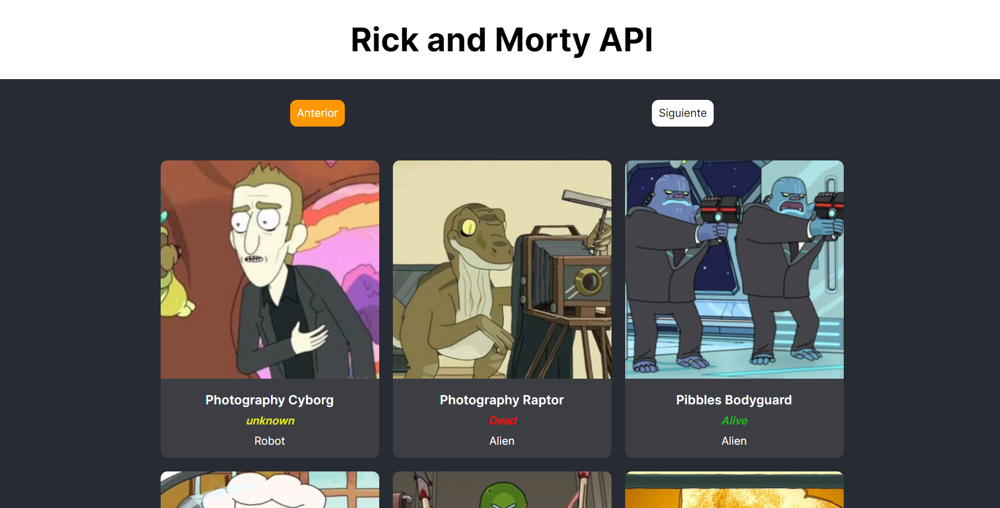

# Tecnologías usadas

- [pnpm](https://pnpm.io/)
- [svelte](https://svelte.dev/)

## Scripts

- Instalar dependencias

```bash
pnpm install
```

- Modo desarrollo

```bash
pnpm run dev
```

## Proyecto


